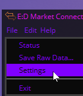

# EDMC-Discord-Presence

A plugin for [Elite Dangerous Market Connector](https://github.com/Marginal/EDMarketConnector) that enables [Discord Rich Presence](https://discordapp.com/rich-presence) for [Elite Dangerous](https://www.elitedangerous.com/)

Show your current location and activity to everyone on Discord from your user profile!

## Installation

1. [Install Elite Dangerous Market Connector](https://github.com/EDCD/EDMarketConnector), and optionally set up your Inara and EDSM accounts with it. Help the community!
2. Download the latest version of the plugin from [here](./releases/latest?plain=true). Make sure to download the release `.zip` and not the source code bundle.
3. Open/Switch to Elite Dangerous Market Connector, then go to File -> Settings.

4. Switch to the "Plugins tab", then click the "Open" button

5. Extract the release `.zip` you downloaded in step 2, and put the folder that comes out (it should contain a `load.py` and a few other things) into it.

6. Restart EDMC. You should see the plugin tell you it's starting up or similar on EDMC's main window.

*Of note, EDMC has to be started and running on the SAME COMPUTER as your Discord client AND Elite itself.*

## Configuration

There isn't any! Just plug & play.

## Contributing, translations, and bug reports!

If you find a bug or an inconsistency, check the [Issues](./issues?plain=true) section of this repository!

If you know another language, [some buffoon](<https://github.com/rglx/>) removed all the old translations when the code was reworked for 4.0. Help translate, please! (and i'm sorry i didnt mean to destroy all that hard work)

If you want to contribute code, work in a fork, then submit a pull request for review.

## Credits

**For the CMDRs by CMDRs.**

Created by [CMDR Garud](https://forums.frontier.co.uk/member.php/136073-Garud) for an awesome gaming community. 
A big thanks to [Jonathan Harris (Marginal)](https://github.com/Marginal) for creating the Python boilerplate code for the Discord Rich Presence SDK. Without his input, the plugin would not have been done. Special mention for the awesome group I am in, [Knights of Karma](http://knightsofkarma.com/), for their continuous support.

Translate to french, migrate from python2 to python3 by [Poneyy](https://github.com/Poneyy)

Everything untranslated and then fully reworked for Odyssey by CMDR rglx.

## License

Developed under [Apache License 2.0](https://choosealicense.com/licenses/apache-2.0/).
